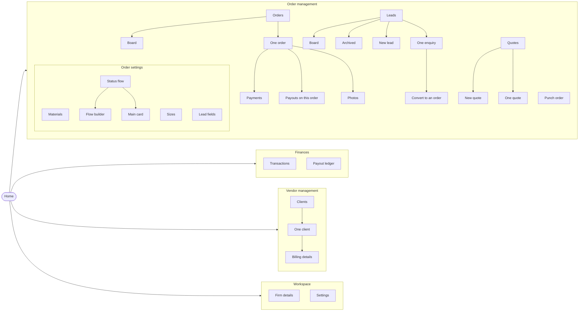

# Navigation

> Generated from `packages/shared/src/navigation.ts`. That file is the one
> source of truth: the web sidebar, the app menu and this document all read
> it, and a test on each client fails when a registered screen is missing
> from it.

## How to keep this true

1. Add the screen to `NAV_GROUPS` (or `children`, when it is reached from
   another screen rather than from the menu).
2. Run `npm --workspace @decor/shared run docs:nav` to rewrite this file.
3. The coverage specs — `apps/web/src/app/coverage.spec.ts` and
   `apps/mobile/src/navigation/coverage.spec.ts` — fail until both are done.

## The map

## Home

| Screen | Web | App route | Permission |
| --- | --- | --- | --- |
| Home | `/` | `Home` | — |
|   ↳ Notifications | — | `Notifications` | — |
|   ↳ Search | — | `Search` | — |

## Categories

### Order management

*Taking work in and moving it along*

| Screen | Web | App route | Permission |
| --- | --- | --- | --- |
| Punch order | `/punch` | `PunchTab` | `order.punch` |
| Orders | `/orders` | `Orders` | `order.view` |
|   ↳ Board | `/board` | `Board` | — |
|   ↳ One order | `/orders/[id]` | `OrderDetail` | — |
|     ↳ Payments | `/orders/[id]/payments` | `Payments` | — |
|     ↳ Payouts on this order | `/orders/[id]/disbursements` | `Disbursements` | — |
|     ↳ Photos | — | `OrderPhotos` | — |
| Leads | `/leads` | `Leads` | `lead.view` |
|   ↳ Board | `/leads/board` | `LeadBoard` | — |
|   ↳ Archived | `/leads/archived` | `ArchivedLeads` | — |
|   ↳ New lead | — | `LeadCreate` | — |
|   ↳ One enquiry | `/leads/[id]` | `LeadDetail` | — |
|     ↳ Convert to an order | — | `LeadConvert` | — |
| Quotes | `/quotes` | `Estimates` | `estimate.view` |
|   ↳ New quote | `/quotes/new` | `EstimateEdit` | — |
|   ↳ One quote | `/quotes/[id]` | `EstimateDetail` | — |

#### Order settings

*What punching offers, and the journey work follows*

| Screen | Web | App route | Permission |
| --- | --- | --- | --- |
| Materials | `/admin/materials` | `AdminMaterials` | `config.view` |
| Sizes | `/admin/sizes` | `AdminSizes` | `config.view` |
| Status flow | `/admin/flow` | `AdminFlow` | `config.view` |
|   ↳ Flow builder | — | `FlowCanvas` | — |
|   ↳ Main card | `/admin/main-card` | `MainCard` | — |
| Lead fields | `/admin/lead-fields` | `AdminLeadFields` | `config.view` |

### Finances

*Money in, money out, and where it is sitting*

| Screen | Web | App route | Permission |
| --- | --- | --- | --- |
| Transactions | `/transactions` | `Transactions` | `payment.cash_position` |
| Payout ledger | `/disbursements` | `DisbursementLedger` | `disbursement.view` |

### Vendor management

*Everyone the shop deals with*

| Screen | Web | App route | Permission |
| --- | --- | --- | --- |
| Clients | `/clients` | `Clients` | `client.view` |
|   ↳ One client | `/clients/[id]` | `ClientDetail` | — |
|     ↳ Billing details | `/clients/[id]/firm` | `ClientFirm` | — |

### Workspace

*The shop itself, and this device*

| Screen | Web | App route | Permission |
| --- | --- | --- | --- |
| Firm details | `/admin/firm` | `FirmProfile` | `config.view` |
| Settings | — | `Settings` | — |

## Outside the menu

*Signing in happens before there is a menu; the platform screens belong to
whoever runs the product rather than to a shop.*

| Screen | Web | App route | Permission |
| --- | --- | --- | --- |
| Sign in | `/login` | `Login` | — |
| Workspaces | `/platform/tenants` | `Tenants` | `platform.tenant.view` |
| Releases | `/platform/releases` | — | `platform.release.view` |
