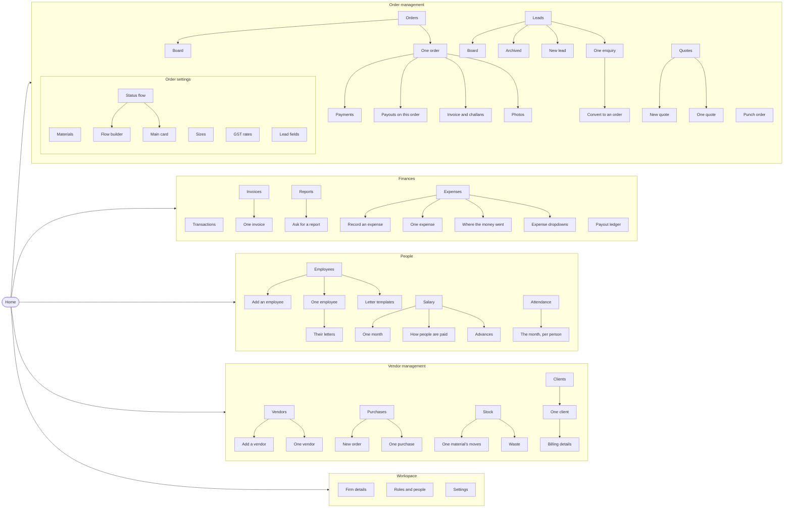

# Navigation

> Generated from `packages/shared/src/navigation.ts`. That file is the one
> source of truth: the web sidebar, the app menu and this document all read
> it, and a test on each client fails when a registered screen is missing
> from it.

## How to keep this true

1. Add the screen to `NAV_GROUPS` (or `children`, when it is reached from
   another screen rather than from the menu).
2. Run `npm --workspace @fas/shared run docs:nav` to rewrite this file.
3. The coverage specs — `apps/web/src/app/coverage.spec.ts` and
   `apps/mobile/src/navigation/coverage.spec.ts` — fail until both are done.

## The map

## Home

| Screen | Web | App route | Permission |
| --- | --- | --- | --- |
| Home | `/` | `Home` | — |
|   ↳ Notifications | `/notifications` | `Notifications` | — |
|   ↳ Search | — | `Search` | — |

## Categories

### Order management

*Taking work in and moving it along*

| Screen | Web | App route | Permission |
| --- | --- | --- | --- |
| Punch order | `/punch` | `PunchTab` | `order.punch` |
| Orders | `/orders` | `Orders` | `order.view` |
|   ↳ Board | `/board` | `Board` | — |
|   ↳ One order | `/orders/[id]` | `OrderDetail` | — |
|     ↳ Payments | `/orders/[id]/payments` | `Payments` | — |
|     ↳ Payouts on this order | `/orders/[id]/disbursements` | `Disbursements` | — |
|     ↳ Invoice and challans | `/orders/[id]/invoice` | `OrderInvoice` | — |
|     ↳ Photos | — | `OrderPhotos` | — |
| Leads | `/leads` | `Leads` | `lead.view` |
|   ↳ Board | `/leads/board` | `LeadBoard` | — |
|   ↳ Archived | `/leads/archived` | `ArchivedLeads` | — |
|   ↳ New lead | — | `LeadCreate` | — |
|   ↳ One enquiry | `/leads/[id]` | `LeadDetail` | — |
|     ↳ Convert to an order | — | `LeadConvert` | — |
| Quotes | `/quotes` | `Estimates` | `estimate.view` |
|   ↳ New quote | `/quotes/new` | `EstimateEdit` | — |
|   ↳ One quote | `/quotes/[id]` | `EstimateDetail` | — |

#### Order settings

*What punching offers, and the journey work follows*

| Screen | Web | App route | Permission |
| --- | --- | --- | --- |
| Materials | `/admin/materials` | `AdminMaterials` | `config.view` |
| Sizes | `/admin/sizes` | `AdminSizes` | `config.view` |
| Status flow | `/admin/flow` | `AdminFlow` | `config.view` |
|   ↳ Flow builder | — | `FlowCanvas` | — |
|   ↳ Main card | `/admin/main-card` | `MainCard` | — |
| GST rates | `/admin/gst` | `AdminGst` | `gst.manage` |
| Lead fields | `/admin/lead-fields` | `AdminLeadFields` | `config.view` |

### Finances

*Money in, money out, and where it is sitting*

| Screen | Web | App route | Permission |
| --- | --- | --- | --- |
| Transactions | `/transactions` | `Transactions` | `payment.cash_position` |
| Payout ledger | `/disbursements` | `DisbursementLedger` | `disbursement.view` |
| Invoices | `/invoices` | `Invoices` | `invoice.view` |
|   ↳ One invoice | `/invoices/[id]` | `InvoiceDetail` | — |
| Reports | `/reports` | `Reports` | `report.view` |
|   ↳ Ask for a report | `/reports/new` | `ReportRequest` | `report.run` |
| Expenses | `/expenses` | `Expenses` | `expense.view` |
|   ↳ Record an expense | `/expenses/new` | `ExpenseForm` | — |
|   ↳ One expense | `/expenses/[id]` | `ExpenseDetail` | — |
|   ↳ Where the money went | `/expenses/analytics` | `ExpenseAnalytics` | — |
|   ↳ Expense dropdowns | `/admin/expense-options` | `AdminExpenseOptions` | `expense.config` |

### People

*Who works here, and what they are paid*

| Screen | Web | App route | Permission |
| --- | --- | --- | --- |
| Employees | `/employees` | `Employees` | `employee.view` |
|   ↳ Add an employee | `/employees/new` | `EmployeeForm` | `employee.manage` |
|   ↳ One employee | `/employees/[id]` | `EmployeeDetail` | — |
|     ↳ Their letters | `/employees/[id]/letters` | `EmployeeLetters` | — |
|   ↳ Letter templates | `/admin/letter-templates` | `AdminLetterTemplates` | `employee.manage` |
| Salary | `/salary` | `Salary` | `salary.view` |
|   ↳ One month | `/salary/[id]` | `SalaryRun` | — |
|   ↳ How people are paid | `/salary/structures` | `PayStructures` | `salary.manage` |
|   ↳ Advances | `/salary/advances` | `SalaryAdvances` | `salary.manage` |
| Attendance | `/attendance` | `Attendance` | `attendance.view` |
|   ↳ The month, per person | `/attendance/month` | `AttendanceMonth` | — |

### Vendor management

*Everyone the shop deals with*

| Screen | Web | App route | Permission |
| --- | --- | --- | --- |
| Vendors | `/vendors` | `Vendors` | `vendor.view` |
|   ↳ Add a vendor | `/vendors/new` | — | `vendor.manage` |
|   ↳ One vendor | `/vendors/[id]` | `VendorDetail` | — |
| Purchases | `/purchases` | `Purchases` | `purchase.view` |
|   ↳ New order | `/purchases/new` | `PurchaseEdit` | `purchase.manage` |
|   ↳ One purchase | `/purchases/[id]` | `PurchaseDetail` | — |
| Stock | `/stock` | `Stock` | `stock.view` |
|   ↳ One material’s moves | `/stock/[materialId]` | `StockMoves` | — |
|   ↳ Waste | `/stock/waste` | `Waste` | — |
| Clients | `/clients` | `Clients` | `client.view` |
|   ↳ One client | `/clients/[id]` | `ClientDetail` | — |
|     ↳ Billing details | `/clients/[id]/firm` | `ClientFirm` | — |

### Workspace

*The shop itself, and this device*

| Screen | Web | App route | Permission |
| --- | --- | --- | --- |
| Firm details | `/admin/firm` | `FirmProfile` | `config.view` |
| Roles and people | `/admin/roles` | `AdminRoles` | `user.view` |
| Settings | `/settings` | `Settings` | — |

## FirstLeap’s own console

*Where the product is run rather than used. Nothing here is gated by a
module — a client’s plan cannot decide what we may see about them — and
every screen needs a platform permission, which no tenant role can hold.*

### The business

*Who is on the platform and what they are worth*

| Screen | Web | App route | Permission |
| --- | --- | --- | --- |
| Overview | `/platform` | `PlatformOverview` | `platform.tenant.view` |
| Workspaces | `/platform/tenants` | `Tenants` | `platform.tenant.view` |
|   ↳ One workspace | `/platform/tenants/[id]` | `TenantDetail` | `platform.tenant.view` |

### What we sell

*Tiers, module prices and what each workspace pays*

| Screen | Web | App route | Permission |
| --- | --- | --- | --- |
| Tiers and prices | `/platform/plans` | `PlatformPlans` | `platform.tenant.view` |
| Billing | `/platform/billing` | `PlatformBilling` | `platform.tenant.view` |

### Ourselves

*Our own people, and the app they ship*

| Screen | Web | App route | Permission |
| --- | --- | --- | --- |
| Staff and roles | `/platform/staff` | `PlatformStaff` | `platform.staff.view` |
| Releases | `/platform/releases` | `PlatformReleases` | `platform.release.view` |

## Outside the menu

*Signing in happens before there is a menu at all.*

| Screen | Web | App route | Permission |
| --- | --- | --- | --- |
| Sign in | `/login` | `Login` | — |
