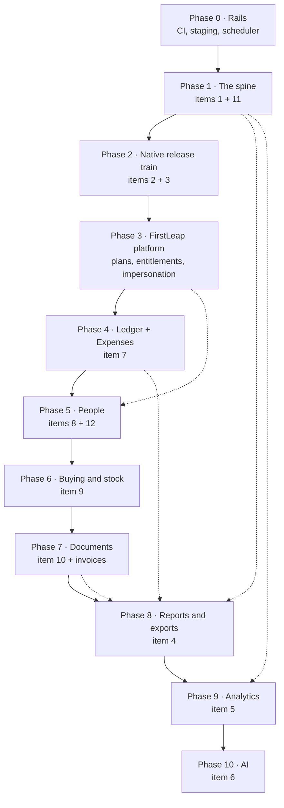

# Roadmap — the next twelve modules

*Written 8 September 2026. Covers the twelve items on the build list plus the
FirstLeap ownership layer, in the order they should be built and the shape they
should take.*

Read the [architecture decisions](#part-1--six-decisions-to-make-first) first.
They are not implementation detail: five of the twelve modules are money
modules, and if each one invents its own way of recording a rupee the books
stop agreeing with themselves by module three. The [phase
order](#part-2--the-order) then follows from those decisions rather than from
the order the modules were asked for. [What is missing from the
list](#part-4--what-the-list-is-missing) is at the end and is worth reading
before starting Phase 0 — two of the gaps change the plan.

---

## Part 0 — where we stand today

| Already built | Notes |
|---|---|
| Multi-tenancy | `Tenant` + `PlatformUser` in a platform DB, `TenantIsolation` SHARED or DEDICATED, provisioning that seeds a working shop, `AsyncLocalStorage` tenant context, `PrismaService.wrap()` |
| RBAC | Per-tenant `Role` rows holding permission strings, `PermissionsGuard`, live permissions read from the role on every request, `syncSystemRoles` on boot |
| Orders / leads / quotes | Punch, configurable status flow with guarded reversal, boards, quotes that link back to leads |
| Money | `Payment`, `CashDeposit`, `Disbursement` (the ISC payout ledger), Transactions screen, GST maths in `common/utils/pricing.ts` |
| Files | `StoredFile` over two backends — Postgres for small, S3 for large — with encryption at rest |
| Navigation | One shared tree, generated `docs/NAVIGATION.md`, three coverage specs that fail when a screen has no home |

| Not built, and assumed by the list | Consequence |
|---|---|
| **No CI at all** (`.github/` does not exist) | Nothing below ships safely; 3,182 tests run only when someone remembers |
| **No staging environment** | OTA channels and push templates have nowhere to be wrong first |
| **No scheduler** in the API | Reports, retention, dead-token pruning, reminders and rollups all need one |
| **`AuditLog` exists but nothing writes to it** | Item 11 is a table waiting for a service |
| **No roles or users screens** on either client | The permission model is real but unreachable; only the API can grant |
| **No invoice document** | Credit notes (item 10) have nothing to credit |
| **No stock, no vendors** | Purchasing (item 9) starts from zero |
| **No Firebase, no Expo modules** in the app | Push and OTA both need a native release |

---

## Part 1 — six decisions to make first

### D1. One money ledger

Every rupee that moves posts a row to a single `LedgerEntry` table: client
payments, cash deposits, ISC payouts, expenses, purchase-bill payments,
salaries, refunds against credit notes. The domain tables keep their own shape —
a `Payment` still knows which order it settles, a `Disbursement` still knows who
was paid — and each one *also* writes its posting.

Without this, Transactions, cash-in-hand, every report and every dashboard have
to be taught about each new money module one at a time, and the first one that
gets forgotten is a hole in the books. With it, a module that does not post is a
module that visibly does not exist in Transactions, which is the failure you
want.

The standing rule survives unchanged: **payouts sit beside orders and are never
netted off them.** The ledger records a payout as its own outflow row against
its own account; an order's collected value is the sum of its payments, and
nothing subtracts from it.

### D2. Three logs, not one

Items 1, 5 and 11 all sound like "log things" and must not share a table.

| | Lives in | Holds | Retention |
|---|---|---|---|
| `AuditEvent` | **tenant DB** | Business record: entity, action, before/after, actor, reason | Forever |
| `ServerLog` | **platform DB** | Request/action outcome, errors, latency, sampled | 30–90 days |
| `AnalyticsEvent` + `AnalyticsSession` | **platform DB**, keyed by `tenantId` | Product usage from web and app | 12 months, rolled up sooner |

The split is deliberate. A tenant's audit trail is *their* business record: it
must travel with their data on export, be deleted with it, and live inside a
dedicated database when they have one. Operational and product telemetry is
*ours*: FirstLeap needs one query across every tenant, which a dedicated
database would hide, and no tenant should be able to edit or lose it.

### D3. Money rows are append-only

Editing a recorded payment writes a reversal row plus a replacement. Deleting
one requires a reason and leaves the reversal visible. Nothing that has touched
the books is ever silently mutated.

This is what makes item 11 *true* rather than decorative, and it is the
mechanism behind the standing constraint: there is no code path that can make an
order look fully paid when less than its value was collected, because the
collection rows cannot be edited away — only reversed, in the open, by someone
named.

### D4. Entitlement × permission

A screen is reachable when **the tenant's plan includes the module** *and*
**the user's role holds the permission**. Two independent gates:

- `NavItem` / `NavGroup` gain an optional `module?: ModuleKey`; the sidebar, the
  app menu and `docs/NAVIGATION.md` already read that tree, so they follow for
  free.
- A `ModuleGuard` sits beside `PermissionsGuard` on the API and refuses at the
  route, because a hidden menu item is not access control.

Decide this before Phase 4, not after. HR, purchasing and AI are the modules a
small tenant will not buy, and retrofitting entitlements across finished modules
is worse than the modules themselves.

### D5. The binary is FirstLeap's; the data is the tenant's

| Platform DB (FirstLeap owns) | Tenant DB (the shop owns) |
|---|---|
| `OtaRelease`, `OtaReleaseAsset`, `AppVersionGate` | `PushDevice`, `Notification`, `PushDispatch` |
| Push credentials, notification template **defaults** | Notification template **overrides** |
| Plans, entitlements, subscriptions, tenant health | Everything else |

One app in the stores, one Firebase project, one OTA channel pair. A tenant
admin edits the wording of their own notifications; only FirstLeap decides what
code the binary runs.

### D6. Background work needs a runner, not a queue server

`@nestjs/schedule` plus Postgres advisory locks, with queue *tables* —
`Report`, `PushDispatch`, `AiJob` — rather than Redis. Advisory locks mean a
second API instance cannot double-fire a cron, which is the only thing Redis
would have bought at this size. Revisit when a single worker stops keeping up.

---

## Part 2 — the order

Three rules produced that order:

1. **Nothing ships safely without CI**, so Phase 0 comes before work anyone can see.
2. **OTA before the long tail.** Every phase from 4 onward is JS-only work. If
   OTA lands first, all of it reaches the floor the day it is written instead of
   waiting on store review. This is the single highest-leverage reordering on the
   list — item 3 was eighth on the list and is second here.
3. **Reports and analytics read everything**, so they come after the things they
   report on. Building item 4 now means rewriting it three times as expenses,
   salaries and purchases arrive.

Sizes below are relative (S ≈ a few days, M ≈ 1–2 weeks, L ≈ 3–4 weeks, XL ≈ more),
assuming the current pace and that tests and both clients ship in the same change.

---

## Part 3 — the phases

### Phase 0 · Rails — **S** — *shipped 8 September 2026*

- **CI** — `.github/workflows/ci.yml`: two jobs (workspaces, mobile), typecheck
  and all four suites on every branch, mobile lint included. `npm run verify`
  runs the same thing locally.
- **Two new rails** — a spec that reads `schema.prisma` and fails when a model
  carrying `tenantId` is not tenant-scoped, and a `.gitignore` for stray `tsc`
  output next to sources (a stale `prisma-mock.js` was shadowing the helper
  every API spec imports, so the suite was testing code nobody could see).
- **The job runner** — `apps/api/src/common/jobs/`: a `JobLease` row rather than
  a Postgres advisory lock, because Prisma pools connections and an advisory
  lock belongs to one; `JobRun` rows recording every outcome including
  `SKIPPED`; two real jobs (nightly tenant-database health, job-log retention).
  Proven against the live database — three simultaneous fires, one ran.
- **Error references** — a global filter gives every error answer an eight
  character reference, passes a refusal through in the words it was written in,
  and says nothing about an unhandled one.
- **`GET /api/health`** — public: status, `APP_ENV`, version, commit, database
  reachability.
- **Rate limiting** on the three doors that open without a token, 30 a minute.

*Still outstanding here: a staging environment (hosting, not code — the API now
reports which deployment it is), and an external error sink such as Sentry,
which needs an account.*

### Phase 1 · The spine — items 1 and 11 — **M** — *shipped 8 September 2026*

- **`AuditEvent`** — the dormant `AuditLog` table is now written underneath
  every write by a Prisma extension, so no write path can skip it. A spec reads
  the tenant-scoped model list and fails when a model is neither audited nor
  exempted with a reason. Only changed fields are kept; file bytes, password
  hashes and connection strings never are; the actor comes from the verified
  token; `withAuditNote({ reason })` carries the why.
- **What a row belongs to** — a line, a payment or a photo records which order
  it hangs off, so an order's history holds the argument rather than only its
  own columns.
- **A History section** on order, enquiry, quote and client detail, on both
  clients, merging the trail with the status moves and dropping the audit row
  whose only change is the stage — the move row says it better.
- **Append-only money** — a receipt is never edited or deleted. Taking one back
  records its opposite, with a reason, and un-banks any cash that had already
  been deposited.
- **`ServerLog`** — an interceptor recording every write and every failure with
  the reference the caller was shown, in the platform database, across tenants.
- **`ClientLog`** — `POST /logs`, with both clients queueing what they saw and
  sending it when the network comes back; crashes are reported on the way down.
- **Retention** — a nightly job keeps 30 days of both operational logs. The
  audit trail is not touched: it is the shop's record, and it is kept.

### Phase 2 · Native release train — items 2 and 3 — **L** — *server side shipped 8 September 2026*

Both need native changes, and a native change means a store release, so they go
out as one release rather than two.

**OTA (item 3)** — the server half is built and proven end to end:

- `common/ota/signing.ts` and `common/ota/manifest.ts`, ported from Expo's
  reference server so the byte-level behaviour matches what the client
  verifies — two hashes per asset (base64url SHA-256 for integrity, hex MD5 for
  identity), RSA-SHA256 signed multipart parts, signing optional until a key is
  configured.
- `OtaRelease` / `OtaReleaseAsset` / `AppVersionGate` in the **platform**
  database: draft → published → archived, sticky-bucket staged rollout,
  rollback-to-embedded, and at most one live release per channel, platform and
  runtime version.
- Assets go through the existing `StorageService`, so a release needs no second
  piece of infrastructure — S3 where it is configured, the database where it is
  not.
- `GET /api/updates/manifest`, `/api/updates/assets/:id` and
  `/api/app/version-check`, all open: the phone asking has not signed in and
  what it gets back is signed code, not a shop's data.
- `npm run ota:publish` uploads what `expo export` produced and creates the
  release, over HTTP rather than against a database, so the same script
  publishes to staging and to production.
- A release console at `/platform/releases` — walk a rollout up in steps, retire
  a release, set the version floor.

*What is left for the app itself:* adopting `expo-updates`, which needs the
React Native decision in [WAITING-ON-YOU.md](WAITING-ON-YOU.md).

**Push (item 2)** — built from the inside out, because the row is the source of
truth and FCM is only the transport that wakes the phone. Shipped:

- A code-owned registry of triggers (`order.moved`, `order.moved_back`,
  `payment.recorded`, `payment.reversed`, `quote.accepted`, `quote.declined`,
  `lead.moved`) whose **wording each shop owns** — a row overrides the default
  or switches the trigger off entirely.
- `Notification` rows, one per person, so read state is theirs alone.
  Recipients are chosen by permission rather than by role name: somebody who
  cannot see payments is not told one was taken, and nobody is told about their
  own doing.
- The words are rendered when it happens and kept: editing a template later
  must not rewrite what people were already told.
- Raising one never throws. A shop must not be unable to move an order because
  telling somebody about it failed.
- Both clients: the app's notification screen — a shell until now — and a web
  page, with a counted bell on each.

*What is left:* the native setup — `@react-native-firebase/{app,messaging}`, an
APNs key, the platform files, the Android 13 runtime permission and notification
channels — which waits on the Firebase account.

**Also in this release, because it is native:** crash reporting in the app.

### Phase 3 · FirstLeap, the platform layer — **M** — *entitlements shipped 8 September 2026*

The ownership hierarchy, made real. Half of it already existed — `Tenant`,
`PlatformUser`, provisioning, `/platform/tenants`.

**Plans and entitlements (D4) — done:**

- A module catalogue and three plans in `@fas/shared`, including the modules
  that do not exist yet, so nothing has to be renamed when they arrive.
- A tenant is on a plan, plus anything granted on top of it — a shop that wants
  one thing from the next tier up should not have to buy the tier. Additive
  only: taking a module away from a shop that is using it is a conversation,
  not a checkbox.
- Two independent gates on the same routes: `ModuleGuard` beside
  `PermissionsGuard`, and both halves asserted in `routes.spec.ts`. A tenant
  admin with every permission still cannot open a module their plan excludes.
- Both menus filter on it, and a plan change takes effect on the next request.
- The plan editor lives in the platform console.
- On the way through, a real leak: `/auth/me` spread the whole identity, and the
  identity carries a dedicated workspace's **decrypted database connection
  string**. Every signed-in person in such a shop was being handed it. It now
  returns named fields, with a spec that fails if that ever changes.

**Staff roles and impersonation — done:**

- Platform people are OWNER, SUPPORT, BILLING or ENGINEER rather than one
  undifferentiated super-user, with permissions resolved live from the role.
- Opening a workspace to help is its own permission, needs a reason in words,
  writes that reason into the *shop's own* audit trail, expires in half an
  hour, borrows their administrator's account rather than inventing one, and
  puts a banner on both clients for as long as it lasts.

**Tenant health — done:** last used, changes made, calls that failed and errors
their app reported, all read from the operational log rather than from anybody's
data, in one query for every workspace.

**Deliberately deferred:** announcements, and subscription records. Neither
blocks anything, and the second wants a commercial answer first — see G11.

### Phase 4 · The ledger and Expenses — item 7 — **L**

- **Done, 8 September.** `LedgerEntry` (D1) exists and payments, deposits and
  settled payouts post to it, idempotently on `(tenantId, sourceType,
  sourceId)`, so the nightly reconcile is safe to run whenever. Transactions
  and cash-in-hand now read the ledger: one ordered table, so paging is the
  database's job, and a module that posts appears on the screen the day it
  ships. Two things the move settled that adding up four tables never could:
  cash handed to a fitter leaves the drawer (shown on its own line, and never
  netted off the order it came from), and a settled payout can no longer be
  cancelled — the money has gone, so what came back is a new record.
  - **Reversing a settled payout** is the mirror of payment reversal:
    `POST /disbursements/:id/reverse` records the opposite row. One that was
    only ever planned is cancelled instead — an intention is not a movement of
    money, so there is nothing to take back.
- **Expenses — done, 8 September.** Ported from momentum-arena's shape:
  `Expense` + `ExpenseOption`, the tenant-editable dropdowns for category,
  paid-by, spent-by, recipient and attribution that are the reason their
  expense screen never needs a developer. Expenses store the **label** rather
  than an option id, so retiring "Diesel" changes what can be picked next and
  never what was recorded last March. Added for this product:
  - **GST fields** — vendor GSTIN, taxable value, ITC eligible — because an
    expense whose tax cannot be claimed is a different number to the accountant.
    They live behind a fold: a form that demands a GSTIN every time is a form
    people stop filling in.
  - an optional **link to an order**, for job costing later. It never reduces
    what the order collected.
  - a cash expense **reducing cash in hand in the same ledger** as everything
    else, and appearing on Transactions as a fourth kind. Which payment types
    are cash is the shop's answer, not ours: each PAYMENT_TYPE option names
    the account it comes out of, and the config screen asks for it.
  - **`ExpenseEditHistory`**, as momentum has it: one row per create, edit and
    reversal, carrying `{ field, from, to }` and the name of whoever did it,
    copied onto the row so the log reads after their account is gone. What
    makes it more than a second audit trail is that the edit form asks *why* —
    and that sentence belongs beside the fields it explains rather than in a
    general log. The audit trail is still written underneath, and shown on the
    same screen.
  - **Append-only, like the rest of the money.** There is no delete. An expense
    is taken back by recording its opposite — negative amount, negative tax,
    the reason — and both rows stand.
  - the **bill photographed at the counter**, through the existing
    `StoredFile`. Optimised as a *size* image rather than a reference one: a
    bill is read, not looked at, and the harder compression that suits a photo
    of a finished panel turns a printed rate into a smudge.

### Phase 5 · People — items 8 and 12 — **L** · *complete, 9 September 2026*

- **`Employee` is the person; `User` is the login. Done, 9 September.** Not
  every employee has an account, an account can be revoked without erasing the
  person, and an office account may belong to somebody who is not on the
  payroll. Linked optionally, in both directions. Nobody is ever deleted:
  somebody who leaves is marked LEFT — last year's attendance and last month's
  payslip hang off the row — and their login is switched off in the same
  breath.
- **Encrypted Aadhaar, PAN and account number**, through the existing
  `EncryptionService`, with the last four kept in clear because that is what a
  screen shows and what somebody reads back over the phone. Two things running
  it made obvious:
  - The whole numbers are a **request of their own** (`GET
    /employees/:id/identifiers`) behind a **permission of their own**, so
    reading one is a deliberate act with a line in the trail rather than a side
    effect of opening a screen.
  - An edit that does not mention an identifier **leaves it alone**. The form
    cannot show what it does not have, so treating absence as "clear it" wiped
    the Aadhaar of anybody whose phone number was corrected. Sending it empty
    still clears it, which is a thing somebody does on purpose.
- **Attendance — done, 9 September.** The naming collision is settled: this app
  means something specific by *punch*, so attendance reads **"mark in / mark
  out"** everywhere, on both clients and in the code.
  - The register is marked **a day at a time**, because that is how a shop does
    it — somebody stands at the door and goes down the list — and it saves in
    one transaction. Half a marked register is worse than an unmarked one:
    nobody can tell which half.
  - The **people lead, not the rows**. A register showing only what was entered
    would make a morning nobody marked look like a morning nobody came in.
  - One row per person per day, so marking twice **corrects** rather than
    counting anybody twice.
  - The month per person — payable days, where a half day counts as half, plus
    overtime in minutes — is what the salary run will read, shown before
    anybody is paid from it.
  - A `calendar.ts` in the shared package came out of this: every date a person
    picks is now a **local** calendar day. `toISOString().slice(0, 10)` answers
    in UTC, so a shop in India opening the register before half past five in
    the morning was shown yesterday.
- **Salary — done, 9 September.** *Decided 8 September: a mix, fully
  configurable* — and that is what it is. Monthly salary, daily wage and piece
  rate are **structures attached to a person**, and somebody can be on more
  than one at once: a base salary plus a rate per panel produces two lines on
  one payslip. Choosing a single shape for the product would have made that
  unrepresentable.
  - **A raise is a new structure**, not an edit. The one it replaces is closed
    the day before the new one starts, so last month's payslip still divides by
    last month's rate.
  - A monthly salary is divided by **the days the shop calls a month**, stated
    when the month is opened and kept on the run — some shops pay for 26 days
    and dividing by 30 would quietly dock everybody four days.
  - **Overtime** is paid once however many structures somebody is on, at the
    rate from the most recently effective one that names one.
  - **Advances** leave the drawer the day they are given, so they post then —
    and come back off payslips oldest-first, never more than the pay, with the
    remainder outstanding. Which advance gave back how much is recorded on the
    payslip: crediting every advance with the whole deduction would mark two
    repaid on one month's recovery.
  - Draft → approved → paid, with **paying gated separately**: working out what
    a month costs and handing the money over are different decisions. A paid
    month cannot be changed, and each payslip **posts its own ledger line**, so
    the month reconciles person by person rather than as a total.
- **Letters — done, 9 September.** Offer, appointment, NDA, responsibilities,
  experience, relieving and warning. Six templates are seeded with a new
  workspace so a shop can hand somebody an offer letter in its first week, and
  every word of them is the shop's to rewrite.
  - **What was handed over is what is kept.** A letter stores its own body, not
    a template id and a promise to render it again: a template edited next year
    must not change what is in an employee's file from last March. The copy
    they hold is the one that counts, and this is ours.
  - Placeholders — `{{name}}`, `{{salary}}`, `{{joinedOn}}` — are filled in on
    the server, so the preview somebody reads and the letter that is filed come
    from the same substitution. One nothing can fill is **left standing**
    rather than blanked: braces are a question somebody can answer, an empty
    space in a sentence is a letter that goes out saying nothing. The template
    screen names any placeholder nothing will ever fill.
  - Printed as HTML on the shop's letterhead, like the estimate, so the app
    turns it into a PDF on the device and the web prints the same markup.
- **Roles and permissions UI (item 12) — done, 9 September.** A role editor
  over `PERMISSION_GROUPS` on both clients, and putting people on roles. The
  seeded four are a starting point, not a fixed set: a shop with a separate
  accountant should be able to say so without asking us.
  - A role cannot be saved if it would **leave nobody able to manage roles** —
    a shop tidying its Owner role and unticking one box would otherwise lock
    every one of them out, and the way back is somebody with database access.
  - A seeded role can be **edited but not removed**; one the shop wrote can be
    removed once nobody is on it.
  - **The gap this made visible, and closed:** a good deal of the API was still
    gated on the coarse `UserRole` enum rather than on permissions, and several
    reads on nothing at all. A permissions editor that governs half the product
    is worse than none — it tells somebody they may not do a thing they can.
    Every write is now on a permission, every read of a shop's own rows too,
    and `routes.spec.ts` fails on the next one that is not. The handful of
    deliberately open reads are listed there by name with the reason.

### Phase 6 · Buying and stock — item 9 — **XL** · *complete, 9 September 2026*

- **Vendor master.** A separate model from `Client` although the columns rhyme:
  the same firm is occasionally both, and merging them would give one screen
  listing everybody the shop deals with in either direction with no way to say
  which way. Retired, never deleted — every purchase hangs off the row.
- **Order → delivery → bill → payment**, four separate acts because a shop does
  them days apart, each gated separately. Ordering and billing are one row: a
  shop this size sends an order and gets a bill against it, and splitting them
  would mean two documents for the one conversation. What has arrived is
  counted **per line**, so an order cannot read "arrived" while a line is
  outstanding — the state a shop chases a supplier from.
- **Stock is summed, never set.** Every change is a `StockMove`; there is no
  level anybody can type over, because a quantity that can be overwritten is a
  quantity with no explanation behind it. Valued at what was actually paid, so
  a rack holding sheets bought at two prices is worth two prices. Broken down
  by thickness, because 18mm and 6mm ply are not interchangeable. Reorder
  alerts fire *at* the level, not below it.
- **Waste is first-class**, and measured against what was **issued** rather than
  what was bought — a shop that buys a hundred sheets and cuts ten has wasted a
  share of ten, and dividing by a hundred would make every month look better the
  more it ordered. An offcut is not waste: it went back on the rack. Waste and a
  stocktake both require a reason.
- **The rule is enforced, not just stated.** Stock arrives only against a
  purchase — recording a receipt by hand is refused — so everything on the rack
  has a bill behind it, and `Expense` is spend that does not become stock.
- **The gap this closed:** Transactions named the kinds it showed, so purchases,
  salaries and advances posted to the ledger and appeared nowhere. It still
  names them (a payout must stay out by construction), but
  `transactions.coverage.spec.ts` now reads every `sourceType` the API posts and
  fails on the next one that is neither shown nor deliberately excluded with a
  written reason.

### Phase 7 · Documents — item 10, and the invoice it needs — **M** · *complete, 9 September 2026*

**Credit notes could not be built first.** A credit note is issued against an
invoice, and the product had no invoice document — it had estimates, orders, GST
maths and a `DocumentSequence` counter, which is most of the way there and not
the thing itself. So the invoice came first and the credit note hangs off it.

- **Nothing here posts to the ledger**, and that is the decision the module
  turns on. An invoice is a claim, not a movement of money; the payment against
  it is the movement, and that already posts. Posting both would count the same
  rupees twice and leave the cash position — the figure this shop actually asks
  about — wrong by everything it had billed and not been paid.
- **Tax invoice**, financial-year dated and gapless within the year (`INV-2627-0001`),
  raised from an order and **one per order**. Progressive billing would mean
  deciding which lines belong to which invoice; this shop bills a job when it
  goes out, so a correction is a credit note — which is what the GST rules
  expect anyway. Everything on it is snapshotted at the moment of issue: the
  client's particulars, the shop's, the rates, and whether the supply crossed a
  state line. A reprint next year is the paper that went out, not a fresh render
  of what things have become since.
- **A number, once used, is used.** An invoice is cancelled, never deleted, and
  its number is never reissued — a gap in the series is the first thing an
  assessing officer asks about. Cancelling requires a reason, and the printed
  document is stamped across its face with it. An invoice with a live credit
  note against it cannot be cancelled at all.
- **Delivery challan** (`DC-2627-0001`), with **no money on it anywhere** — not
  on the screen and not on the paper. It travels with the goods and is read by
  whoever takes delivery; what the job cost is between the shop and whoever
  ordered it. More than one per order, unlike an invoice: a job often leaves in
  two vans on two days. It carries a receiver's signature line, because that
  signature is the only proof the goods arrived.
- **Credit note** (`CN-2627-0001`) against an invoice, with a named reason and a
  sentence in the shop's own words. The GST is reversed in the proportion the
  invoice charged it — a credit against an IGST invoice reverses IGST — and the
  total credited can never exceed what was billed, or a bill would turn into
  money owed to the client, which is a different document. The paper says
  "Credit Note" in the largest type on it, names the invoice it credits, and
  states on its face that it is not a receipt.
- **The receivable is three figures — charged, credited, received — and stays
  three** on both clients. Credited money is never counted as received: an order
  billed ₹1,18,000, credited ₹11,800 and paid ₹1,06,200 is settled, and every
  screen says exactly that rather than showing ₹1,18,000 collected. Nothing
  folds one into another anywhere.
- **The defect running it caught.** The first invoice raised against a real
  order billed a ₹1,18,000 job at **₹0**. Five of the shop's six orders are
  quoted as one lump figure for the whole job — that figure lives on the order,
  and its lines carry the material and the size and no money at all — so an
  invoice that added its lines up billed nothing. The invoice now restates the
  order's own money rather than recomputing it, which also keeps the two
  documents reconcilable; and a lump-sum job prints as one line carrying what
  was agreed, described by the work it was made of, at the rate that was
  actually charged rather than the slab that applies today.

*Left for later: e-invoice (IRN) and e-way bill behind an entitlement — needed
only above the turnover threshold, and the invoice model does not have to change
when they arrive. Debit notes, until the shop raises one. Chasing an overdue
invoice: `dueOn` is recorded and nothing reads it yet.*

### Phase 8 · Reports and exports — item 4 — **M**

*Decided 8 September: an accounting export is wanted as an option, so the ledger
in Phase 4 records account head, party, tax split and voucher kind — and the
CA's copy is an Excel workbook rather than invoices raised somewhere else.*

Queued jobs, exactly momentum's shape: a `Report` row goes QUEUED → GENERATING →
READY → EXPIRED, a scheduled worker builds the workbook, bytes are stored
through `StorageService`, retention nulls them and keeps the row for audit.
XLSX via `exceljs`; PDF via the renderer the estimates already use; the app
hands the file to the existing share sheet.

The set worth shipping for this shop: GST summary by slab (B2B/B2C, HSN), sales
register, **order register with stage ageing** (what is stuck and for how long),
cash book and payments, receivables by client, **payout ledger** as its own
report, expenses by category and by person, material consumption and waste,
salary register, purchase register, client statement, quote conversion.

Exports carry the same constraint as the screens: there is no "hide the payouts"
option and no export that reports an order as settled for less than it collected.

### Phase 9 · Analytics — item 5 — **M**

Two audiences, one pipeline.

- **For the shop**: revenue and collections over time, WIP value by stage,
  **stage cycle times** — which come free from `OrderStatusHistory` and are the
  most useful number nobody currently sees — lead → quote → order conversion,
  material and waste trends, per-operator and per-machine throughput once Phase 6
  and Phase 5 land.
- **For FirstLeap**: adoption per tenant, which modules are used, which are paid
  for and untouched, retention, where people give up. Read from the telemetry
  tables in the platform DB.
- `MetricRollup` written hourly so a 90-day chart is one indexed scan.
- Charts: recharts on web; Skia and `react-native-svg` are already in the app.

### Phase 10 · AI — item 6 — **L**

Last, because everything below is what makes it worth anything, and because
every output should be a draft laid on top of a workflow that is already correct.

Architecture: an `ai` module with a provider abstraction (Claude first), a
versioned prompt registry, per-tenant enablement, **budget caps and per-tenant
token metering** (it is a billable cost, so it is a plan feature), PII redaction
before anything leaves, and every request and response stored under retention so
a wrong answer can be traced.

Ranked by value for this business:

1. **WhatsApp or a photo into a draft order.** Orders arrive as messages and
   photographs of handwritten notes. Turning one into a filled punch screen that
   a human confirms is the highest-value thing on this list.
2. **Enquiry into a draft quote** — sizes, material and rates proposed from the
   lead's own words and the shop's own price history.
3. **Ask the data** — natural language over the Phase 9 rollups through a
   constrained query layer. The model chooses among defined queries; it never
   writes SQL.
4. Photo tagging and QC notes on order attachments.

Hard rule: **AI never commits money, never moves a status, never sends anything
to a client.** It fills a form a person presses save on.

---

## Part 4 — what the list is missing

Ordered by how much it would hurt to discover late.

| | Gap | Why it matters | Where it goes |
|---|---|---|---|
| **G1** | **CI and a staging environment** | There is no `.github/` directory. Twelve modules onto an untested trunk is how a shop's live books break on a Tuesday | Phase 0, before everything |
| **G2** | **Tax invoices** | Item 10 has nothing to credit without them; also the document the client actually asks for | Phase 7 |
| **G3** | **WhatsApp to clients** | Push reaches staff who install the app. Clients live on WhatsApp — "your order is at polishing" is the notification that sells the product. A Business API account takes weeks to approve, so **apply during Phase 0** | Application in Phase 0, build after Phase 4 |
| **G4** | **Stock and waste as its own thing** | Waste is first-class in this business and appears nowhere on the list; it is currently invisible margin | Phase 6 |
| **G5** | **Production and machine scheduling** | Four machines, a queue and no way to say which job runs where — it also supplies the operator numbers HR and analytics need | After Phase 6 |
| **G6** | **Backups, per-tenant export and deletion** | A SaaS obligation, and DPDP requires the deletion path. Dedicated databases make it harder, not easier | Phase 3 |
| **G7** | **Offline on the floor** | A factory has patchy wifi; the app assumes a connection. Punching and status moves should queue | Phase 2 or soon after |
| **G8** | **Hindi** | Floor staff. It is cheap now and expensive after 40 screens | Start in Phase 2, finish gradually |
| **G9** | **Session revocation, refresh tokens, 2FA for the owner** | Permissions are read live now, which was the right fix; sessions still cannot be killed | Phase 3 |
| **G10** | **A client portal** | One link showing a client their own order — cheap, and it is what a WhatsApp message should point at | After G3 |
| **G11** | **Taking the subscription money** | The plan model is Phase 3; actually charging a tenant is a separate decision (invoice by hand at first is a legitimate answer) | Phase 3, or deliberately deferred |
| **G12** | **A demo tenant** | Selling this needs a workspace with believable data on it | Phase 3 |
| **G13** | **Approval workflows** | Discounts, expenses above a limit, salary advances — every one of these will grow an approver | Alongside Phase 4 |
| **G14** | **Financial-year rollover** | Numbering series, opening balances, "last year" in every report | Phase 7 |
| **G15** | **Rate limiting on the API** | Public login especially | Phase 0 or 3 |

---

## Part 5 — decisions, answered 8 September 2026

*All five are answered. They are kept in
[WAITING-ON-YOU.md](WAITING-ON-YOU.md) alongside the accounts and credentials
still outstanding, because they are the assumptions the phases ahead are built
on and it is cheaper to find a wrong one written down.*

- **React Native pins back to 0.86.3** to adopt Expo Updates, taking Momentum's
  proven combination. Reanimated 4 and worklets re-checked against it.
- **Pay is a mix, and fully configurable** — Phase 5 builds monthly salary,
  daily wage and piece rate as per-employee structures rather than choosing one.
- **GST invoices are raised from this system**, on demand and downloadable; the
  CA is served by an Excel export rather than raising them elsewhere.
- **Modules are sold separately** — shipped.
- **A Tally / accounting export is wanted**, so Phase 4's ledger records account
  head, party, tax split and voucher kind, not only an amount and a date.
- **A declined quote moves its enquiry**, to a stage the shop configures —
  shipped.

Each has my recommendation; none of them blocks Phase 0 or Phase 1.

1. **React Native 0.87.1 → 0.86.3 to adopt Expo Updates?**
   *Recommend yes* — one minor back, a proven combination, and it unblocks
   same-day delivery for every later phase. The alternative is waiting for SDK 58.
2. **WhatsApp Business API — start the account now?**
   *Recommend yes*, in Phase 0. Approval lead time is the constraint, not the code.
3. **Which AI first?** *Recommend the WhatsApp/photo → draft order path.*
4. **How does the floor get paid** — monthly salary, daily wage, piece rate, or a
   mix? This decides the shape of the salary run, so I need it before Phase 5.
5. **Are you issuing GST invoices from this system**, or does the CA raise them
   in Tally today? If Tally, Phase 7 also needs an export they can import.
6. **Do tenants buy modules separately from day one?** *Recommend yes* — the
   entitlement layer is cheap now and a rewrite later.
7. **Is a Tally / accounting export required?** It changes what the ledger has to
   record, so it is better known before Phase 4 than after.

---

## Working rules for every phase

Unchanged, and they apply to all of the above:

- The app ships first, the web reaches parity in the same change.
- Every new screen goes into `packages/shared/src/navigation.ts`, `docs/NAVIGATION.md`
  is regenerated, and the three coverage specs stay green.
- Tests ship with the feature, in the same change; money logic first.
- Every module declares a permission and a module key.
- Everything that moves money posts to the ledger.
- Payouts sit beside orders and are never netted off them.
