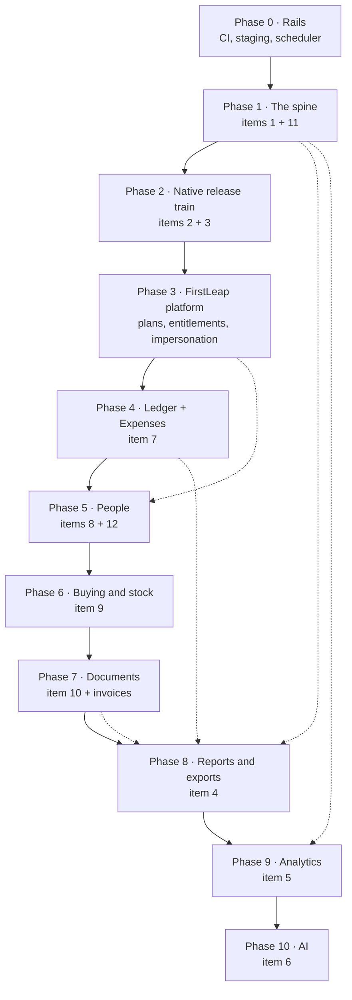

# Roadmap — the next twelve modules

*Written 8 September 2026. Covers the twelve items on the build list plus the
FirstLeap ownership layer, in the order they should be built and the shape they
should take.*

Read the [architecture decisions](#part-1--six-decisions-to-make-first) first.
They are not implementation detail: five of the twelve modules are money
modules, and if each one invents its own way of recording a rupee the books
stop agreeing with themselves by module three. The [phase
order](#part-2--the-order) then follows from those decisions rather than from
the order the modules were asked for. [What is missing from the
list](#part-4--what-the-list-is-missing) is at the end and is worth reading
before starting Phase 0 — two of the gaps change the plan.

---

## Part 0 — where we stand today

| Already built | Notes |
|---|---|
| Multi-tenancy | `Tenant` + `PlatformUser` in a platform DB, `TenantIsolation` SHARED or DEDICATED, provisioning that seeds a working shop, `AsyncLocalStorage` tenant context, `PrismaService.wrap()` |
| RBAC | Per-tenant `Role` rows holding permission strings, `PermissionsGuard`, live permissions read from the role on every request, `syncSystemRoles` on boot |
| Orders / leads / quotes | Punch, configurable status flow with guarded reversal, boards, quotes that link back to leads |
| Money | `Payment`, `CashDeposit`, `Disbursement` (the ISC payout ledger), Transactions screen, GST maths in `common/utils/pricing.ts` |
| Files | `StoredFile` over two backends — Postgres for small, S3 for large — with encryption at rest |
| Navigation | One shared tree, generated `docs/NAVIGATION.md`, three coverage specs that fail when a screen has no home |

| Not built, and assumed by the list | Consequence |
|---|---|
| **No CI at all** (`.github/` does not exist) | Nothing below ships safely; 3,182 tests run only when someone remembers |
| **No staging environment** | OTA channels and push templates have nowhere to be wrong first |
| **No scheduler** in the API | Reports, retention, dead-token pruning, reminders and rollups all need one |
| **`AuditLog` exists but nothing writes to it** | Item 11 is a table waiting for a service |
| **No roles or users screens** on either client | The permission model is real but unreachable; only the API can grant |
| **No invoice document** | Credit notes (item 10) have nothing to credit |
| **No stock, no vendors** | Purchasing (item 9) starts from zero |
| **No Firebase, no Expo modules** in the app | Push and OTA both need a native release |

---

## Part 1 — six decisions to make first

### D1. One money ledger

Every rupee that moves posts a row to a single `LedgerEntry` table: client
payments, cash deposits, ISC payouts, expenses, purchase-bill payments,
salaries, refunds against credit notes. The domain tables keep their own shape —
a `Payment` still knows which order it settles, a `Disbursement` still knows who
was paid — and each one *also* writes its posting.

Without this, Transactions, cash-in-hand, every report and every dashboard have
to be taught about each new money module one at a time, and the first one that
gets forgotten is a hole in the books. With it, a module that does not post is a
module that visibly does not exist in Transactions, which is the failure you
want.

The standing rule survives unchanged: **payouts sit beside orders and are never
netted off them.** The ledger records a payout as its own outflow row against
its own account; an order's collected value is the sum of its payments, and
nothing subtracts from it.

### D2. Three logs, not one

Items 1, 5 and 11 all sound like "log things" and must not share a table.

| | Lives in | Holds | Retention |
|---|---|---|---|
| `AuditEvent` | **tenant DB** | Business record: entity, action, before/after, actor, reason | Forever |
| `ServerLog` | **platform DB** | Request/action outcome, errors, latency, sampled | 30–90 days |
| `AnalyticsEvent` + `AnalyticsSession` | **platform DB**, keyed by `tenantId` | Product usage from web and app | 12 months, rolled up sooner |

The split is deliberate. A tenant's audit trail is *their* business record: it
must travel with their data on export, be deleted with it, and live inside a
dedicated database when they have one. Operational and product telemetry is
*ours*: FirstLeap needs one query across every tenant, which a dedicated
database would hide, and no tenant should be able to edit or lose it.

### D3. Money rows are append-only

Editing a recorded payment writes a reversal row plus a replacement. Deleting
one requires a reason and leaves the reversal visible. Nothing that has touched
the books is ever silently mutated.

This is what makes item 11 *true* rather than decorative, and it is the
mechanism behind the standing constraint: there is no code path that can make an
order look fully paid when less than its value was collected, because the
collection rows cannot be edited away — only reversed, in the open, by someone
named.

### D4. Entitlement × permission

A screen is reachable when **the tenant's plan includes the module** *and*
**the user's role holds the permission**. Two independent gates:

- `NavItem` / `NavGroup` gain an optional `module?: ModuleKey`; the sidebar, the
  app menu and `docs/NAVIGATION.md` already read that tree, so they follow for
  free.
- A `ModuleGuard` sits beside `PermissionsGuard` on the API and refuses at the
  route, because a hidden menu item is not access control.

Decide this before Phase 4, not after. HR, purchasing and AI are the modules a
small tenant will not buy, and retrofitting entitlements across finished modules
is worse than the modules themselves.

### D5. The binary is FirstLeap's; the data is the tenant's

| Platform DB (FirstLeap owns) | Tenant DB (the shop owns) |
|---|---|
| `OtaRelease`, `OtaReleaseAsset`, `AppVersionGate` | `PushDevice`, `Notification`, `PushDispatch` |
| Push credentials, notification template **defaults** | Notification template **overrides** |
| Plans, entitlements, subscriptions, tenant health | Everything else |

One app in the stores, one Firebase project, one OTA channel pair. A tenant
admin edits the wording of their own notifications; only FirstLeap decides what
code the binary runs.

### D6. Background work needs a runner, not a queue server

`@nestjs/schedule` plus Postgres advisory locks, with queue *tables* —
`Report`, `PushDispatch`, `AiJob` — rather than Redis. Advisory locks mean a
second API instance cannot double-fire a cron, which is the only thing Redis
would have bought at this size. Revisit when a single worker stops keeping up.

---

## Part 2 — the order

Three rules produced that order:

1. **Nothing ships safely without CI**, so Phase 0 comes before work anyone can see.
2. **OTA before the long tail.** Every phase from 4 onward is JS-only work. If
   OTA lands first, all of it reaches the floor the day it is written instead of
   waiting on store review. This is the single highest-leverage reordering on the
   list — item 3 was eighth on the list and is second here.
3. **Reports and analytics read everything**, so they come after the things they
   report on. Building item 4 now means rewriting it three times as expenses,
   salaries and purchases arrive.

Sizes below are relative (S ≈ a few days, M ≈ 1–2 weeks, L ≈ 3–4 weeks, XL ≈ more),
assuming the current pace and that tests and both clients ship in the same change.

---

## Part 3 — the phases

### Phase 0 · Rails — **S** — *shipped 8 September 2026*

- **CI** — `.github/workflows/ci.yml`: two jobs (workspaces, mobile), typecheck
  and all four suites on every branch, mobile lint included. `npm run verify`
  runs the same thing locally.
- **Two new rails** — a spec that reads `schema.prisma` and fails when a model
  carrying `tenantId` is not tenant-scoped, and a `.gitignore` for stray `tsc`
  output next to sources (a stale `prisma-mock.js` was shadowing the helper
  every API spec imports, so the suite was testing code nobody could see).
- **The job runner** — `apps/api/src/common/jobs/`: a `JobLease` row rather than
  a Postgres advisory lock, because Prisma pools connections and an advisory
  lock belongs to one; `JobRun` rows recording every outcome including
  `SKIPPED`; two real jobs (nightly tenant-database health, job-log retention).
  Proven against the live database — three simultaneous fires, one ran.
- **Error references** — a global filter gives every error answer an eight
  character reference, passes a refusal through in the words it was written in,
  and says nothing about an unhandled one.
- **`GET /api/health`** — public: status, `APP_ENV`, version, commit, database
  reachability.
- **Rate limiting** on the three doors that open without a token, 30 a minute.

*Still outstanding here: a staging environment (hosting, not code — the API now
reports which deployment it is), and an external error sink such as Sentry,
which needs an account.*

### Phase 1 · The spine — items 1 and 11 — **M**

- **`AuditEvent`** — a Prisma client extension captures before/after on a
  registered list of models, with the actor pulled from the tenant context.
  Domain moves that are not row diffs (status moved, status *reversed*, money
  recorded, quote sent) are written explicitly so they read as sentences rather
  than as JSON diffs.
- **A History tab** on order, payment, lead, quote and client detail — both
  clients. Orders and leads already show status history; this widens it to
  edits, and gives payments one for the first time.
- **Append-only money** (D3): reversal + replacement, with reason.
- **`ServerLog`** — an interceptor recording action, outcome, latency, tenant
  and actor, sampled for reads and complete for writes.
- **Client logs** — a batched, MMKV-queued ingest endpoint from the app and web,
  so a crash on the floor is visible without asking someone to describe it.
- Retention crons for both operational tables.

*Reference: momentum-arena `lib/server-log.ts`, `ServerActionLog` — same shape,
plus the tenant column and the audit half it does not have.*

### Phase 2 · Native release train — items 2 and 3 — **L**

Both need native changes, and a native change means a store release, so they go
out as one release rather than two.

**OTA (item 3)** — ported from momentum-arena, which self-hosts Expo Updates:

- `lib/ota/signing.ts` and `lib/ota/manifest.ts` port **verbatim** (they are
  Expo's reference implementation: base64url SHA-256 asset hashes, hex MD5
  keys, RSA-SHA256 signed multipart parts).
- The manifest and asset routes become a Nest module; assets go to S3 through
  the existing `StorageService` instead of Vercel Blob.
- `OtaRelease` / `OtaReleaseAsset` / `AppVersionGate` in the **platform** DB
  (D5); draft → published → archived, sticky-bucket staged rollout,
  rollback-to-embedded, `sequence` stamped into `extra.otaBuildNumber`.
- `scripts/publish-ota.ts` + an `ota-publish` workflow that compares a **native
  fingerprint** against a committed baseline and refuses to publish JS when the
  native side moved.
- The rollout console lives under FirstLeap, not under a tenant.

> **Blocker to decide now.** `expo-updates` needs the Expo modules in the bare
> app. Expo SDK 57 (current) pins **react-native 0.86.3**; this app is on
> **0.87.1**. Either pin back one minor for the adoption — which also means
> re-checking Reanimated 4 and worklets — or wait for SDK 58. Momentum-arena
> runs SDK 56 on RN 0.85.2, so the combination is proven one version back.
> My recommendation: **pin to 0.86.3.** Waiting costs every later phase its
> same-day delivery.

**Push (item 2)** — also ported, with two changes:

- Native setup the app has none of today: `@react-native-firebase/{app,messaging}`,
  an APNs key, `google-services.json` / `GoogleService-Info.plist`, the iOS push
  capability, the Android 13 runtime permission and notification channels.
- `PushDevice` (token + platform + app version + user), `PushDispatch` (delivery
  log), `PushTemplate` (tenant overrides over a code-owned registry, so wording
  changes without a deploy) — all in the tenant DB; fan-out iterates tenants for
  dedicated databases.
- **`Notification` rows are the source of truth**, the push only surfaces them —
  this is what finally fills `NotificationsScreen`, which is a shell today.
- Triggers for this product: status moved, **status reversed** (the reversal
  already asks for confirmation; the people who did not do it should hear about
  it), payment recorded, quote accepted or declined, lead assigned, payout due,
  a daily digest of what is sitting in each stage.
- Dead-token pruning on `registration-token-not-registered`.

**Also in this release, because it is native:** crash reporting in the app.

*Reference: `lib/push.ts` (320 lines), `lib/push-templates.ts` (537 lines, a
20-trigger registry), `app/api/mobile/admin/push/*`, `apps/mobile/src/lib/push.ts`.*

### Phase 3 · FirstLeap, the platform layer — **M**

The ownership hierarchy you described, made real. Half of it exists — `Tenant`,
`PlatformUser`, provisioning, `/platform/tenants`. What is missing:

- **Plans and entitlements** (D4): a plan is a set of module keys; a tenant has
  a plan plus overrides; `ModuleGuard` and the nav tree enforce it.
- **FirstLeap staff roles** — support, billing, engineering. Today a platform
  user is all-or-nothing.
- **Impersonation** — signing into a tenant as their admin to help them, with a
  banner the whole time, a hard time limit, and an `AuditEvent` in *their* log
  saying FirstLeap did it. This is the single most-requested support capability
  and the single most dangerous one; it does not ship without the audit half.
- **Tenant health** — last activity, orders punched this week, storage used,
  seats, plan, trial end. Read from the telemetry tables built in Phase 1.
- **Provisioning from the dashboard** — the API exists; the screen does not.
- **Announcements** — a message FirstLeap can put in front of every tenant.
- **Subscription records** — plan, price, billing period, invoices to the tenant.
  (Taking the money is a separate question; see G11.)

### Phase 4 · The ledger and Expenses — item 7 — **L**

- Introduce `LedgerEntry` (D1) and migrate payments, deposits and disbursements
  onto it, leaving those tables and their screens exactly as they behave now.
  Transactions and cash-in-hand start reading the ledger.
- **Expenses**, ported from momentum-arena's shape: `Expense` +
  `ExpenseEditHistory` + `ExpenseOption` (tenant-editable dropdowns for
  category, paid-by, mode — the reason their expense screen never needs a
  developer). Add, for this product:
  - a bill photo through the existing `StoredFile`,
  - **GST fields** — vendor GSTIN, taxable value, ITC eligible — because an
    expense that cannot be claimed is a different number to the accountant,
  - an optional **link to an order**, so job costing is possible later,
  - a cash expense reducing cash in hand *in the same ledger* as everything else.

### Phase 5 · People — items 8 and 12 — **L**

- **`Employee` is the person; `User` is the login.** Not every employee has an
  account, and an account can be revoked without erasing the person. Link them
  optionally.
- Employee master with encrypted Aadhaar/PAN through the existing
  `EncryptionService`, and last-4 kept in clear for display, as momentum does.
- **Attendance** — and a naming collision to settle: this app already means
  something specific by *punch*. Attendance should read **"mark in / mark out"**.
- **Salary** — monthly plus **daily wage and piece rate**, which is how a CNC
  floor actually pays; overtime; advances against salary; a monthly salary run
  producing payslips that **post to the ledger** as outflows (D1).
- Letters — offer, NDA, responsibility — port from momentum's templates, which
  snapshot what was printed so history survives an edit to the employee.
- **Roles and permissions UI** (item 12), which does not exist on either client
  today: a role editor over `PERMISSION_GROUPS`, user invites, and per-module
  permissions for everything phases 4–10 add.

### Phase 6 · Buying and stock — item 9 — **XL**

The largest genuinely new module, because it brings inventory with it.

- **Vendor master** — the "Vendor management" category currently holds only
  Clients, which is a hint the model was always intended.
- Purchase order → goods receipt → purchase bill → payment, each posting to the
  ledger.
- **Material stock and valuation** against the existing `Material` /
  `MaterialThickness`, with reorder alerts.
- **Consumption and wastage** — offcuts and scrap are first-class in this
  business and are the number the owner cannot see today. Consumption links a
  sheet to the order it was cut for; the remainder is either stock or waste, and
  waste is a reportable number, not a rounding difference.
- Rule to settle here: a purchase bill is the source for anything that becomes
  stock; `Expense` is for spend that does not. Both post to the ledger, so
  neither can hide from Transactions.

### Phase 7 · Documents — item 10, and the invoice it needs — **M**

**Credit notes cannot be built first.** A credit note is issued against an
invoice, and this product has no invoice document — it has estimates, orders,
GST maths and a `DocumentSequence` counter, which is most of the way there and
not the thing itself.

- **Tax invoice**: financial-year-aware, gapless numbering; the firm's own
  particulars from `FirmProfile`; CGST/SGST/IGST split already implemented in
  `pricing.ts`; issued from an order.
- **Delivery challan** for dispatch.
- **Credit note** against an invoice, with a reason, the GST reversal, its
  effect on receivables and its posting to the ledger. Debit note if they raise
  them.
- E-invoice (IRN) and e-way bill behind an entitlement — needed only above the
  turnover threshold, but the invoice model should not have to change when it is.

### Phase 8 · Reports and exports — item 4 — **M**

Queued jobs, exactly momentum's shape: a `Report` row goes QUEUED → GENERATING →
READY → EXPIRED, a scheduled worker builds the workbook, bytes are stored
through `StorageService`, retention nulls them and keeps the row for audit.
XLSX via `exceljs`; PDF via the renderer the estimates already use; the app
hands the file to the existing share sheet.

The set worth shipping for this shop: GST summary by slab (B2B/B2C, HSN), sales
register, **order register with stage ageing** (what is stuck and for how long),
cash book and payments, receivables by client, **payout ledger** as its own
report, expenses by category and by person, material consumption and waste,
salary register, purchase register, client statement, quote conversion.

Exports carry the same constraint as the screens: there is no "hide the payouts"
option and no export that reports an order as settled for less than it collected.

### Phase 9 · Analytics — item 5 — **M**

Two audiences, one pipeline.

- **For the shop**: revenue and collections over time, WIP value by stage,
  **stage cycle times** — which come free from `OrderStatusHistory` and are the
  most useful number nobody currently sees — lead → quote → order conversion,
  material and waste trends, per-operator and per-machine throughput once Phase 6
  and Phase 5 land.
- **For FirstLeap**: adoption per tenant, which modules are used, which are paid
  for and untouched, retention, where people give up. Read from the telemetry
  tables in the platform DB.
- `MetricRollup` written hourly so a 90-day chart is one indexed scan.
- Charts: recharts on web; Skia and `react-native-svg` are already in the app.

### Phase 10 · AI — item 6 — **L**

Last, because everything below is what makes it worth anything, and because
every output should be a draft laid on top of a workflow that is already correct.

Architecture: an `ai` module with a provider abstraction (Claude first), a
versioned prompt registry, per-tenant enablement, **budget caps and per-tenant
token metering** (it is a billable cost, so it is a plan feature), PII redaction
before anything leaves, and every request and response stored under retention so
a wrong answer can be traced.

Ranked by value for this business:

1. **WhatsApp or a photo into a draft order.** Orders arrive as messages and
   photographs of handwritten notes. Turning one into a filled punch screen that
   a human confirms is the highest-value thing on this list.
2. **Enquiry into a draft quote** — sizes, material and rates proposed from the
   lead's own words and the shop's own price history.
3. **Ask the data** — natural language over the Phase 9 rollups through a
   constrained query layer. The model chooses among defined queries; it never
   writes SQL.
4. Photo tagging and QC notes on order attachments.

Hard rule: **AI never commits money, never moves a status, never sends anything
to a client.** It fills a form a person presses save on.

---

## Part 4 — what the list is missing

Ordered by how much it would hurt to discover late.

| | Gap | Why it matters | Where it goes |
|---|---|---|---|
| **G1** | **CI and a staging environment** | There is no `.github/` directory. Twelve modules onto an untested trunk is how a shop's live books break on a Tuesday | Phase 0, before everything |
| **G2** | **Tax invoices** | Item 10 has nothing to credit without them; also the document the client actually asks for | Phase 7 |
| **G3** | **WhatsApp to clients** | Push reaches staff who install the app. Clients live on WhatsApp — "your order is at polishing" is the notification that sells the product. A Business API account takes weeks to approve, so **apply during Phase 0** | Application in Phase 0, build after Phase 4 |
| **G4** | **Stock and waste as its own thing** | Waste is first-class in this business and appears nowhere on the list; it is currently invisible margin | Phase 6 |
| **G5** | **Production and machine scheduling** | Four machines, a queue and no way to say which job runs where — it also supplies the operator numbers HR and analytics need | After Phase 6 |
| **G6** | **Backups, per-tenant export and deletion** | A SaaS obligation, and DPDP requires the deletion path. Dedicated databases make it harder, not easier | Phase 3 |
| **G7** | **Offline on the floor** | A factory has patchy wifi; the app assumes a connection. Punching and status moves should queue | Phase 2 or soon after |
| **G8** | **Hindi** | Floor staff. It is cheap now and expensive after 40 screens | Start in Phase 2, finish gradually |
| **G9** | **Session revocation, refresh tokens, 2FA for the owner** | Permissions are read live now, which was the right fix; sessions still cannot be killed | Phase 3 |
| **G10** | **A client portal** | One link showing a client their own order — cheap, and it is what a WhatsApp message should point at | After G3 |
| **G11** | **Taking the subscription money** | The plan model is Phase 3; actually charging a tenant is a separate decision (invoice by hand at first is a legitimate answer) | Phase 3, or deliberately deferred |
| **G12** | **A demo tenant** | Selling this needs a workspace with believable data on it | Phase 3 |
| **G13** | **Approval workflows** | Discounts, expenses above a limit, salary advances — every one of these will grow an approver | Alongside Phase 4 |
| **G14** | **Financial-year rollover** | Numbering series, opening balances, "last year" in every report | Phase 7 |
| **G15** | **Rate limiting on the API** | Public login especially | Phase 0 or 3 |

---

## Part 5 — decisions I need from you

Each has my recommendation; none of them blocks Phase 0 or Phase 1.

1. **React Native 0.87.1 → 0.86.3 to adopt Expo Updates?**
   *Recommend yes* — one minor back, a proven combination, and it unblocks
   same-day delivery for every later phase. The alternative is waiting for SDK 58.
2. **WhatsApp Business API — start the account now?**
   *Recommend yes*, in Phase 0. Approval lead time is the constraint, not the code.
3. **Which AI first?** *Recommend the WhatsApp/photo → draft order path.*
4. **How does the floor get paid** — monthly salary, daily wage, piece rate, or a
   mix? This decides the shape of the salary run, so I need it before Phase 5.
5. **Are you issuing GST invoices from this system**, or does the CA raise them
   in Tally today? If Tally, Phase 7 also needs an export they can import.
6. **Do tenants buy modules separately from day one?** *Recommend yes* — the
   entitlement layer is cheap now and a rewrite later.
7. **Is a Tally / accounting export required?** It changes what the ledger has to
   record, so it is better known before Phase 4 than after.

---

## Working rules for every phase

Unchanged, and they apply to all of the above:

- The app ships first, the web reaches parity in the same change.
- Every new screen goes into `packages/shared/src/navigation.ts`, `docs/NAVIGATION.md`
  is regenerated, and the three coverage specs stay green.
- Tests ship with the feature, in the same change; money logic first.
- Every module declares a permission and a module key.
- Everything that moves money posts to the ledger.
- Payouts sit beside orders and are never netted off them.
